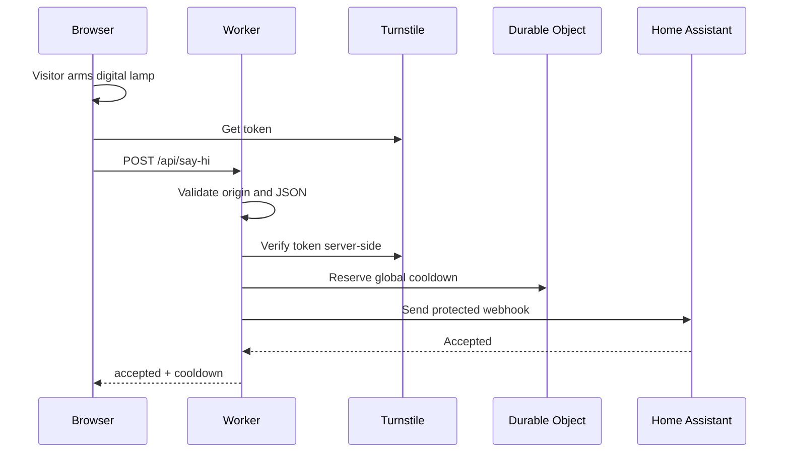

# Hugo Spångberg Portfolio

Professional portfolio for Hugo Spångberg, built with React, TypeScript, Vite and Three.js.

## Stack

- React 19, Vite 7, TypeScript strict
- Three.js for interactive 3D scenes
- Vitest, React Testing Library and Playwright
- Cloudflare Workers/Pages for the Say hi API
- Zod for request validation

## Say hi flow



## Development

```sh
npm ci
npm run dev
```

Quality gates:

```sh
npm run lint
npm run typecheck
npm run test
npm run test:coverage
npm run build
npm run e2e
```

## Environment

Use `.dev.vars.example` as a template. Real secrets must be configured as Cloudflare Worker secrets, never committed.

Key variables:

- `VITE_SAY_HI_ENABLED`
- `VITE_TURNSTILE_SITE_KEY`
- `ALLOWED_ORIGIN`
- `TURNSTILE_SECRET_KEY`
- `HOME_AUTOMATION_WEBHOOK_URL`
- `HOME_AUTOMATION_ACCESS_CLIENT_ID`
- `HOME_AUTOMATION_ACCESS_CLIENT_SECRET`
- `SAY_HI_ENABLED`
- `SAY_HI_COOLDOWN_SECONDS`
- `SAY_HI_USE_MOCK_GATEWAY`

## Architecture and security

See `docs/architecture.md`, `docs/security.md` and the ADRs in `docs/adr`.

## Home Assistant

See `home-assistant/README.md` and `home-assistant/say-hi-automation.example.yaml`.

## Known limitations

- Canonical URL, sitemap and Open Graph metadata currently use `https://www.example.com` placeholders.
- Preview deployments use mock home automation by design.
- A real production light requires Cloudflare secrets and Home Assistant setup.
