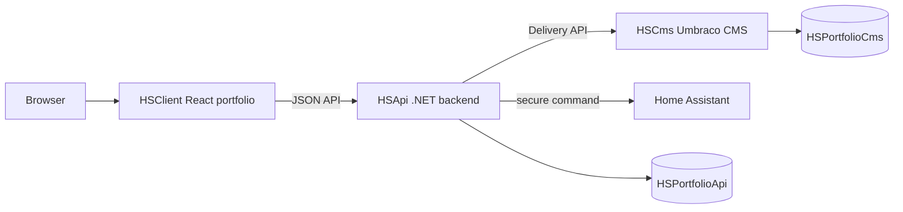

# Hugo Spangberg Portfolio

Professional fullstack portfolio for Hugo Spangberg, focused on .NET, React, Umbraco, Three.js and pragmatic system design.

## Architecture



- `HSClient`: public React/Vite portfolio, Three.js career world, Say Hi UI and static fallback content.
- `HSApi`: ASP.NET Core API, portfolio aggregation, Say Hi orchestration, EF Core operational data and health checks.
- `HSCms`: Umbraco 17 headless CMS for editorial content and media.

HSClient does not call HSCms directly. HSApi is the application boundary.

## Local Setup

```bash
npm install
dotnet restore HugoSpangberg.Portfolio.sln
```

Run services:

```bash
npm run dev:client
npm run dev:api
npm run dev:cms
```

Common checks:

```bash
npm run lint
npm run typecheck
npm run test:client
npm run build:client
dotnet build HugoSpangberg.Portfolio.sln --configuration Release
dotnet test HugoSpangberg.Portfolio.sln --configuration Release
```

## Environment

Copy `.env.example` to `.env` for local values. Do not commit real secrets.

Public client values:

- `VITE_API_BASE_URL`
- `VITE_TURNSTILE_SITE_KEY`
- `VITE_SAY_HI_ENABLED`

Server-side values:

- `ConnectionStrings__HSPortfolioApi`
- `Cms__BaseUrl`
- `Turnstile__SecretKey`
- `HomeAssistant__WebhookUrl`
- `HomeAssistant__AccessClientId`
- `HomeAssistant__AccessClientSecret`

## CMS

HSCms is Umbraco 17 with Delivery API enabled. Content is edited in Umbraco, fetched by HSApi, validated, cached as snapshots and returned to HSClient as a stable contract.

See `Docs/CMS/publishing-flow.md`.

## Say Hi

Say Hi is handled by HSApi:

1. HSClient sends one greeting request.
2. HSApi validates request input.
3. HSApi verifies Turnstile when enabled.
4. HSApi enforces idempotency and cooldown.
5. HSApi calls Home Assistant only from the backend.
6. HSClient shows success only after HSApi confirms success.

Automated tests do not call real Home Assistant.

## Career World Assets

The runtime still has procedural Three.js landmark fallback. Blender scripts under `Assets/Blender/Scripts` define the planned GLB pipeline.

```bash
bash Scripts/export-models.sh
npm run models:validate
```

Blender output is not committed until generated and verified. Reference photos with unclear rights live under ignored private assets.

## Documentation

- `Docs/Architecture/system-overview.md`
- `Docs/Architecture/request-flow.md`
- `Docs/Architecture/data-ownership.md`
- `Docs/security.md`
- `Docs/testing-strategy.md`
- `Docs/ADR/`
