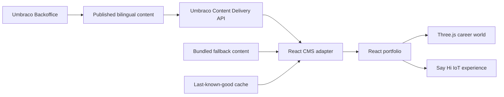
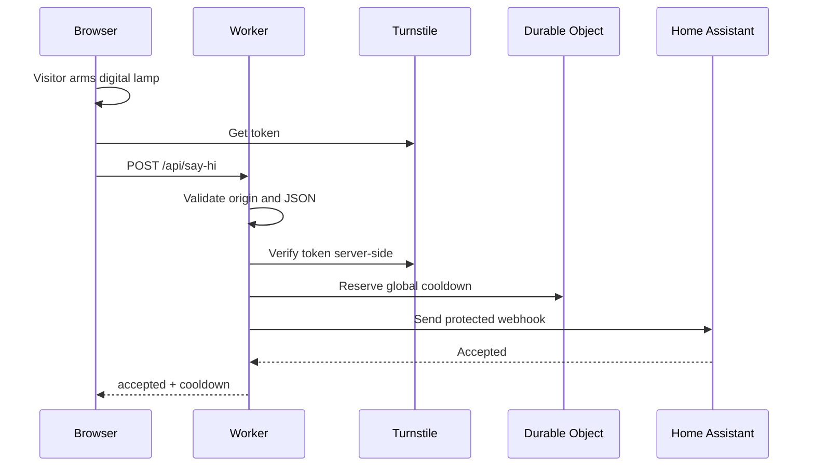

# Hugo Spångberg Portfolio

Professional portfolio for Hugo Spångberg, built with React, TypeScript, Vite, Three.js and a headless Umbraco CMS.



## Stack

- React 19, Vite 7, TypeScript strict
- Three.js for interactive 3D scenes
- Umbraco CMS 17.4.2 as a headless CMS
- .NET 10 for the CMS
- uSync 17.3.5 for CMS schema synchronization
- Vitest, React Testing Library and Playwright
- Cloudflare Workers/Pages for the Say hi API
- Zod for request validation

## Frontend and CMS separation

The public website remains the React/Vite frontend. Umbraco runs separately as a
headless CMS and exposes only published portfolio content through the Content
Delivery API. React validates and maps that JSON before rendering it.

If the CMS is unavailable, the site renders bundled fallback content. If a
previous CMS response was valid, the frontend can use it as a last-known-good
cache per locale.

## Say hi flow



## Development

```sh
npm ci
npm run dev
```

Run frontend and CMS separately:

```sh
npm run dev:frontend
npm run dev:cms
```

CMS commands:

```sh
npm run cms:restore
npm run cms:build
npm run cms:test
```

Quality gates:

```sh
npm run lint
npm run typecheck
npm run test
npm run test:coverage
npm run build
npm run e2e
```

## Environment

Use `.dev.vars.example` as a template. Real secrets must be configured as Cloudflare Worker secrets, never committed.

Use `.env.example` for public frontend CMS values and local Umbraco setup placeholders.

Key variables:

- `VITE_SAY_HI_ENABLED`
- `VITE_CMS_ENABLED`
- `VITE_UMBRACO_BASE_URL`
- `VITE_UMBRACO_CONTENT_ROUTE`
- `VITE_CMS_REQUEST_TIMEOUT_MS`
- `VITE_TURNSTILE_SITE_KEY`
- `ALLOWED_ORIGIN`
- `TURNSTILE_SECRET_KEY`
- `HOME_AUTOMATION_WEBHOOK_URL`
- `HOME_AUTOMATION_ACCESS_CLIENT_ID`
- `HOME_AUTOMATION_ACCESS_CLIENT_SECRET`
- `SAY_HI_ENABLED`
- `SAY_HI_COOLDOWN_SECONDS`
- `SAY_HI_USE_MOCK_GATEWAY`

CMS local setup placeholders:

- `UMBRACO_ADMIN_EMAIL`
- `UMBRACO_ADMIN_PASSWORD`
- `UMBRACO_ADMIN_NAME`
- `UMBRACO_DATABASE_DSN`
- `UMBRACO_DATABASE_PROVIDER`

## Architecture and security

See `docs/architecture.md`, `docs/security.md`, `docs/cms-architecture.md`,
`docs/cms-security.md` and the ADRs in `docs/adr`.

CMS-specific documentation:

- `cms/README.md`
- `docs/cms-content-model.md`
- `docs/cms-development.md`
- `docs/cms-deployment.md`
- `docs/cms-editor-guide.md`

## Home Assistant

See `home-assistant/README.md` and `home-assistant/say-hi-automation.example.yaml`.

## Known limitations

- Canonical URL, sitemap and Open Graph metadata currently use `https://www.example.com` placeholders.
- Preview deployments use mock home automation by design.
- A real production light requires Cloudflare secrets and Home Assistant setup.
