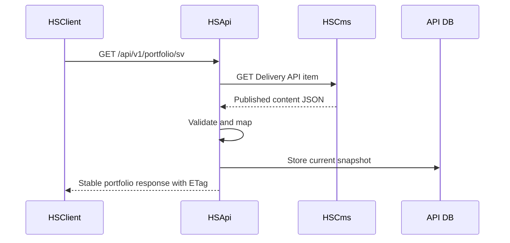
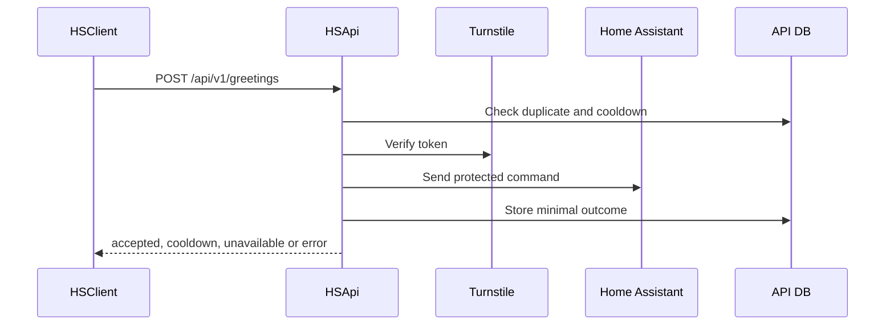

# Request Flow

## Portfolio Content

```mermaid
sequenceDiagram
  participant C as HSClient
  participant A as HSApi
  participant U as HSCms
  participant D as API DB

  C->>A: GET /api/v1/portfolio/sv
  A->>U: GET Delivery API item
  U-->>A: Published content JSON
  A->>A: Validate and map
  A->>D: Store current snapshot
  A-->>C: Stable portfolio response with ETag
```

If HSCms is unavailable, HSApi serves the latest valid snapshot. If no snapshot exists, HSApi serves bundled seed content.

## Say Hi

```mermaid
sequenceDiagram
  participant C as HSClient
  participant A as HSApi
  participant T as Turnstile
  participant H as Home Assistant
  participant D as API DB

  C->>A: POST /api/v1/greetings
  A->>D: Check duplicate and cooldown
  A->>T: Verify token
  A->>H: Send protected command
  A->>D: Store minimal outcome
  A-->>C: accepted, cooldown, unavailable or error
```
