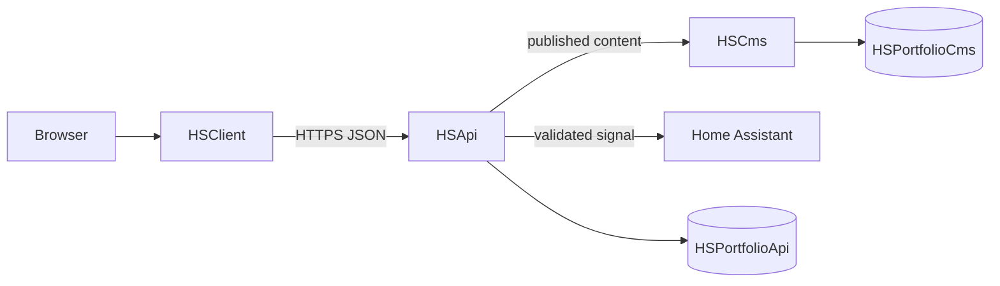

# System Overview

The portfolio is split into three applications:

`HSClient` is the public React application. It owns rendering, Three.js, localized UI state and static fallback content.

`HSApi` is the public application-data boundary. It validates requests, aggregates CMS content, caches last-known-good content, handles Say Hi, and owns operational EF Core data.

`HSCms` is Umbraco 17 in headless mode. It owns editorial content and its own database. `HSApi` only talks to HSCms through HTTP Content Delivery API responses.
