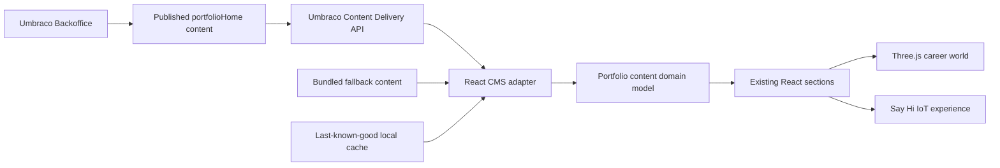

# CMS Architecture

React remains the public rendering application. Umbraco is used as a headless
editorial system for published bilingual content. The CMS adapter validates and
maps Delivery API JSON before any React component sees it.

The Say Hi backend, Turnstile configuration, Home Assistant secrets, cooldowns,
and rate limits remain outside Umbraco. CMS copy can describe the experience,
but it cannot control infrastructure.

## Loading Strategy

1. Render bundled fallback immediately.
2. Fetch fresh published CMS content when `VITE_CMS_ENABLED=true`.
3. Validate and map CMS content.
4. Store valid content as last-known-good cache.
5. On CMS errors, use cache if valid, otherwise fallback.

## Cultures

Frontend locales map to Umbraco cultures as:

- `sv` -> `sv-SE`
- `en` -> `en-US`
